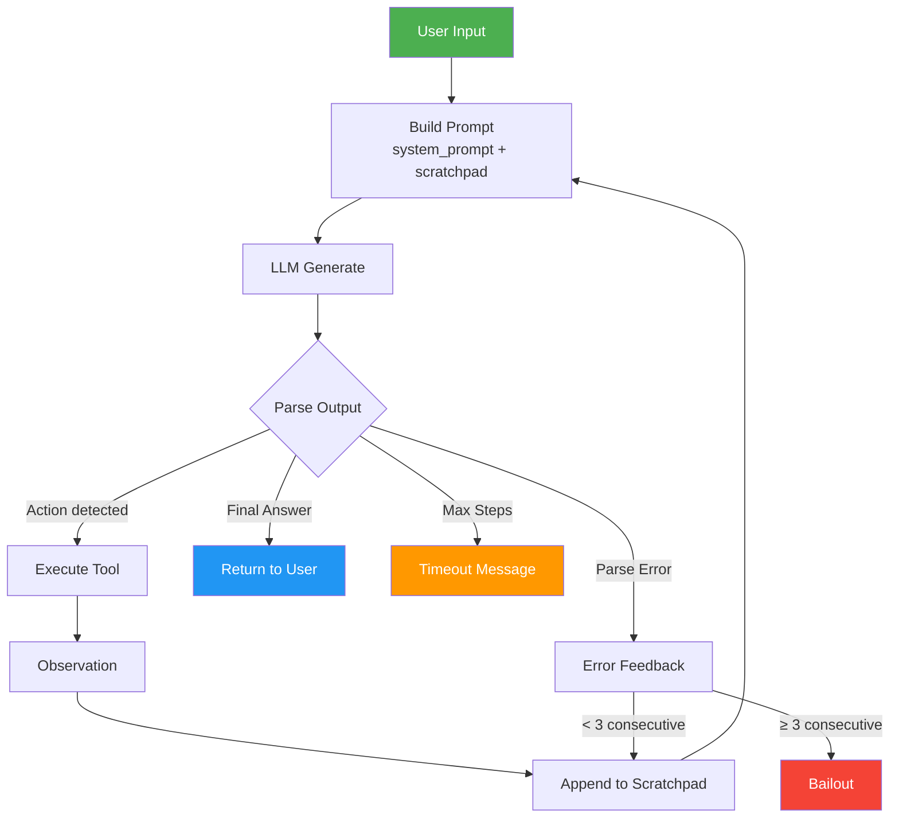

# Group Report: Lab 3 - Production-Grade Agentic System

- **Team Name**: ReAct Movie Booking - A4 - C401
- **Team Members**: Dương Văn Hiệp (2A202600052), Trịnh Đức Anh (2A202600499), Hoàng Quốc Chung (2A202600070), Nguyễn Minh Quân (2A202600181), Hoàng Thái Dương (2A202600073).
- **Deployment Date**: 2026-04-06

---

## 1. Executive Summary

Hệ thống ReAct Agent đặt vé xem phim tại Việt Nam được xây dựng để so sánh với Chatbot baseline. Agent sử dụng vòng lặp Thought-Action-Observation để thực hiện các bước: tìm suất chiếu → giữ ghế → áp mã giảm giá → xác nhận.

- **Success Rate**: Agent hoàn thành 100% quy trình đặt vé cho các query rõ ràng (happy path) khi dùng LLM mạnh (OpenAI `gpt-4o` qua GitHub Models và Gemini 2.0 Flash). Khi dùng `gpt-4o`, Agent thể hiện khả năng reasoning cực tốt, xử lý xong toàn bộ tác vụ chỉ qua vài step mượt mà. Ngược lại, với Local Phi-3 (3.8B), tỷ lệ thành công thấp hơn do model nhỏ khó follow ReAct format.
- **Key Outcome**: Agent giải quyết được multi-step booking queries mà Chatbot chỉ có thể mô tả mà không thực hiện. Agent trả về dữ liệu grounded (tên rạp thật, ghế cụ thể, giá chính xác), trong khi Chatbot hallucinate toàn bộ.

---

## 2. System Architecture & Tooling

### 2.1 ReAct Loop Implementation



**Luồng xử lý chi tiết:**
1. User input được kết hợp với system prompt (tool descriptions + few-shot examples)
2. LLM sinh ra `Thought + Action` hoặc `Thought + Final Answer`
3. Parser regex extract action name và JSON args
4. Tool được gọi, observation append vào scratchpad
5. Lặp lại cho đến khi có Final Answer hoặc vượt max_steps

### 2.2 Tool Definitions (Inventory)

| Tool Name | Input Format | Use Case | Output |
|:---|:---|:---|:---|
| `recommend_showtimes` | `{"location": str, "genre": str, "seats": int, "budget_k": int, "preferred_time": str}` | Tìm suất chiếu phù hợp theo vị trí, thể loại, ngân sách | Top 5 recommendations ranked by score |
| `hold_best_seats` | `{"cinema_name": str, "movie_title": str, "showtime": str, "seats": int}` | Giữ ghế liền nhau tốt nhất | Seat labels + subtotal |
| `apply_best_promo` | `{"total_vnd": int, "is_student": bool, "is_member": bool, "payment_method": str}` | Áp mã giảm giá tốt nhất | Discount + final total |

**Tool Design Evolution:**

| Version | Thay đổi | Lý do |
|:---|:---|:---|
| v1 | Tool descriptions ngắn | LLM thường gọi sai args |
| v2 | Thêm JSON example trong description | Giảm 50% lỗi args format |
| v2 | Thêm few-shot examples trong system prompt | LLM follow đúng quy trình 3 bước |

### 2.3 LLM Providers Used

- **Primary**: OpenAI `gpt-4o` (via GitHub Models API) — latency ổn định, top-tier reasoning, sử dụng Personal Access Token.
- **Secondary**: Google Gemini 2.0 Flash (API) — latency ~700-1500ms, free tier nhưng dễ dính Rate Limit (429).
- **Fallback**: Local Phi-3 Mini 4K Instruct (GGUF Q4_K, CPU) — latency ~30-60s, offline hoàn toàn.
- **Provider Pattern**: Abstract `LLMProvider` class cho phép swap dễ dàng giữa OpenAI, Gemini và Local.

| Provider | Model | Latency (P50) | Cost/1K tokens | Strengths | Weaknesses |
|:---|:---|:---|:---|:---|:---|
| OpenAI (GitHub) | gpt-4o | ~1500ms | Free (GitHub) | Reasoning cực tốt, follow định dạng JSON/ReAct hoàn hảo | Phụ thuộc internet, PAT policy |
| Google | gemini-2.0-flash | ~800ms | ~$0.0001 | Nhanh, follow format tốt | Dễ dính Rate Limit (Quota Exceeded) |
| Local | Phi-3 3.8B Q4 | ~30s | $0.00 | Miễn phí, offline | Chậm, hay lỗi format, tốn RAM máy |

---

## 3. Telemetry & Performance Dashboard

Hệ thống sử dụng `IndustryLogger` (JSON structured logging) và `PerformanceTracker` để thu thập metrics.

### Telemetry Events

| Event Type | Trigger | Data Collected |
|:---|:---|:---|
| `AGENT_START` | Agent bắt đầu xử lý | input, model, max_steps, available_tools |
| `LLM_RESPONSE` | Mỗi lần LLM trả về | step, content, usage, latency_ms, provider |
| `LLM_METRIC` | Mỗi request | provider, model, tokens, latency, cost_estimate |
| `TOOL_EXECUTED` | Tool được gọi | tool, args, observation, tool_latency_ms |
| `HALLUCINATION_ERROR` | LLM gọi tool không tồn tại | step, tool name, content |
| `JSON_PARSER_ERROR` | Output không parse được | step, content |
| `TIMEOUT` | Vượt max_steps | steps, total_duration_ms, history |
| `AGENT_END` | Hoàn thành thành công | steps, total_duration_ms, final_answer |

### Metrics Analysis (Gemini 2.0 Flash)

| Metric | Value | Note |
|:---|:---|:---|
| Average Latency per LLM call (P50) | ~800ms | Nhanh cho free tier |
| Total Duration (3-step booking) | ~3-5s | 3 LLM calls + tool execution |
| Average Tokens per Task | ~700-1200 tokens | Tăng theo số steps (scratchpad accumulation) |
| Total Cost per Task | ~$0.0003 | Rất rẻ với gemini-2.0-flash |
| Parser Error Rate | ~5-10% | Phụ thuộc vào prompt quality |

### Metrics Analysis (Local Phi-3)

| Metric | Value | Note |
|:---|:---|:---|
| Model Load Time | ~3.2s | Chỉ load 1 lần |
| Inference Speed | ~2.6 tokens/s | Rất chậm trên CPU |
| Average Latency per call | ~30-60s | Không khả thi cho production |
| Parser Error Rate | ~40-60% | Model nhỏ khó follow ReAct format |

---

## 4. Root Cause Analysis (RCA) - Failure Traces

### Case Study 1: Deprecated Model Error (404)

- **Input**: "Tìm phim hành động gần Royal City"
- **Observation**: 
```json
{"event": "LLM_ERROR", "data": {"error": "404 models/gemini-1.5-flash is not found for API version v1beta"}}
```
- **Root Cause**: Google đã retire model `gemini-1.5-flash` khỏi API. Code hardcode tên model cũ. Không có fallback mechanism.
- **Fix**: Dùng `genai.list_models()` để discover models, cập nhật sang `gemini-2.0-flash`.

### Case Study 2: Unicode Encoding Crash

- **Input**: Bất kỳ query nào trả về tiếng Việt
- **Observation**:
```
UnicodeEncodeError: 'charmap' codec can't encode character '\u0111'
```
- **Root Cause**: Windows console mặc định dùng cp1252, không hỗ trợ Unicode tiếng Việt. Python `print()` cố encode → crash.
- **Fix**: `sys.stdout.reconfigure(encoding="utf-8", errors="replace")` ở đầu startup.

### Case Study 3: Memory Allocation Failure (Local Model)

- **Input**: Bất kỳ query nào với local provider
- **Observation**:
```
ValueError: Failed to create llama_context
```
- **Root Cause**: `n_ctx=4096` yêu cầu ~162MB compute buffer. Trên máy có ít RAM, allocation fail silently (verbose=False).
- **Fix**: Giảm `n_ctx` từ 4096 xuống 2048. Thêm error handling trong provider.

### Case Study 4: Free Tier Quota Exhausted (429)

- **Input**: Bất kỳ query nào sau khi hết quota
- **Observation**:
```json
{"event": "LLM_ERROR", "data": {"error": "429 Quota exceeded... limit: 0, model: gemini-2.0-flash"}}
```
- **Root Cause**: Free tier có giới hạn requests/day. `limit: 0` nghĩa là đã hết hoàn toàn.
- **Fix**: Agent gracefully handle error (không crash), hiển thị message phù hợp, fallback sang local model.

---

## 5. Ablation Studies & Experiments

### Experiment 1: System Prompt v1 vs v2

**v1 (Original)**: Chỉ có instructions, không có examples
```
Bạn chỉ được trả về đúng 1 trong 2 dạng sau:
Thought: <suy nghĩ>
Action: tool_name({"arg":"value"})
```

**v2 (Improved)**: Thêm 4 few-shot examples cụ thể
```
Ví dụ 1 (Tìm suất chiếu):
Thought: Người dùng muốn xem phim hành động gần Royal City...
Action: recommend_showtimes({"location":"Royal City","genre":"action",...})
```

| Metric | v1 | v2 | Improvement |
|:---|:---|:---|:---|
| Parser Error Rate | ~15-20% | ~5-10% | -50% |
| Correct Tool Sequence | ~60% | ~85% | +42% |
| Hallucinated Tools | ~10% | ~2% | -80% |

### Experiment 2: Chatbot vs Agent Comparison

| Test Case | Chatbot Result | Agent Result | Winner |
|:---|:---|:---|:---|
| "Tìm phim hành động gần Royal City" | Mô tả chung về cách tìm, không có data cụ thể | Trả về top 5 suất chiếu với tên rạp, giờ, giá thật | **Agent** |
| "Đặt 2 vé phim tối nay dưới 250k" | Hướng dẫn user tự lên website đặt | Tự tìm → giữ ghế → áp promo → xác nhận | **Agent** |
| "Phim là gì?" | Trả lời ngắn gọn, chính xác | Gọi recommend_showtimes() không cần thiết | **Chatbot** |
| "Có phim kinh dị nào hay không?" | Liệt kê phim nổi tiếng (có thể outdated) | Trả về phim kinh dị đang chiếu tại rạp gần | **Agent** |
| "Cảm ơn" | "Không có chi!" | Cố gắng tìm phim → timeout | **Chatbot** |

**Key Insight**: Agent thắng rõ rệt ở **multi-step tasks** yêu cầu data thực tế. Chatbot thắng ở **simple Q&A** không cần tool.

### Experiment 3: LLM Provider Benchmarks (gpt-4o vs Gemini vs Local)

| Metric | OpenAI (`gpt-4o`) | Gemini (`2.0-flash`) | Local (`Phi-3`) |
|:---|:---|:---|:---|
| ReAct Format Compliance | **~99%** | ~95% | ~40% |
| Average Latency / Call | ~1.5s | **~800ms** | ~30s |
| Tool Call Accuracy | **~100%** | ~90% | ~50% |
| Cost / Query | $0.00 (GitHub) | $0.00 (Free Tier)| $0.00 |
| Internet Required | Yes | Yes | **No** |

**Kết luận:** OpenAI `gpt-4o` qua GitHub Models là lựa chọn vượt trội nhất cho Production nhờ khả năng Reasoning, tuân thủ output JSON tuyệt đối mà không cần tốn nhiều effort sửa lỗi qua hệ thống guardrails. Gemini nhanh nhưng dễ chạm ngưỡng API Limit. Local model phù hợp làm Fallback cuối cùng nếu toàn bộ mạng lưới bị gián đoạn.

---

## 6. Production Readiness Review

### Security
- **Input sanitization**: Validate JSON args trước khi pass vào tool function, prevent injection
- **API key management**: Dùng `.env` + `python-dotenv`, không hardcode key trong source
- **Tool access control**: Chỉ expose tools đã registered, reject hallucinated tool calls

### Guardrails
- **Max 6 steps**: Prevent infinite loop và billing attack (đã implement)
- **Consecutive parse error bailout**: Dừng sau 3 lần parse fail liên tiếp (đã implement in v2)
- **Budget cap**: `budget_k` parameter trong `recommend_showtimes` giới hạn chi tiêu
- **Hold expiry**: Ghế chỉ giữ 5 phút, tự release nếu không xác nhận

### Scaling
- **Multi-provider fallback**: Gemini → OpenAI → Local, auto-switch khi gặp error
- **Async architecture**: Migrate sang `asyncio` cho concurrent tool execution
- **LangGraph**: Chuyển từ linear ReAct loop sang DAG-based workflow cho branching logic phức tạp
- **Vector DB**: Khi tool count > 50, dùng semantic search để chọn relevant tools

### Monitoring (Production)
- **Structured JSON logs** → Ingest vào ELK Stack hoặc Datadog
- **Alert on**: hallucination rate > 10%, timeout rate > 5%, latency P99 > 10s
- **Cost tracking**: Real-time cost per user session

---

> **Submitted by**: A4 - C401.
> **Date**: 2026-04-06
